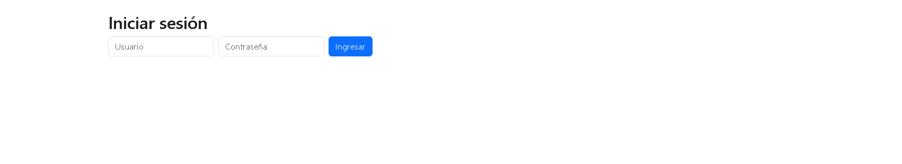
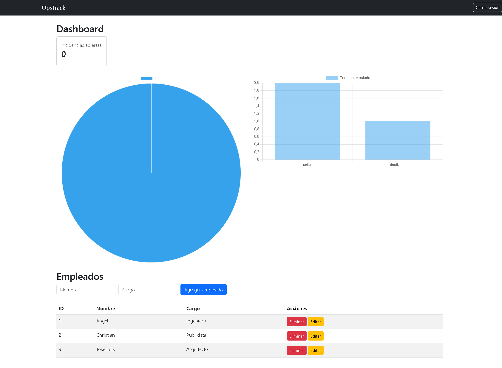
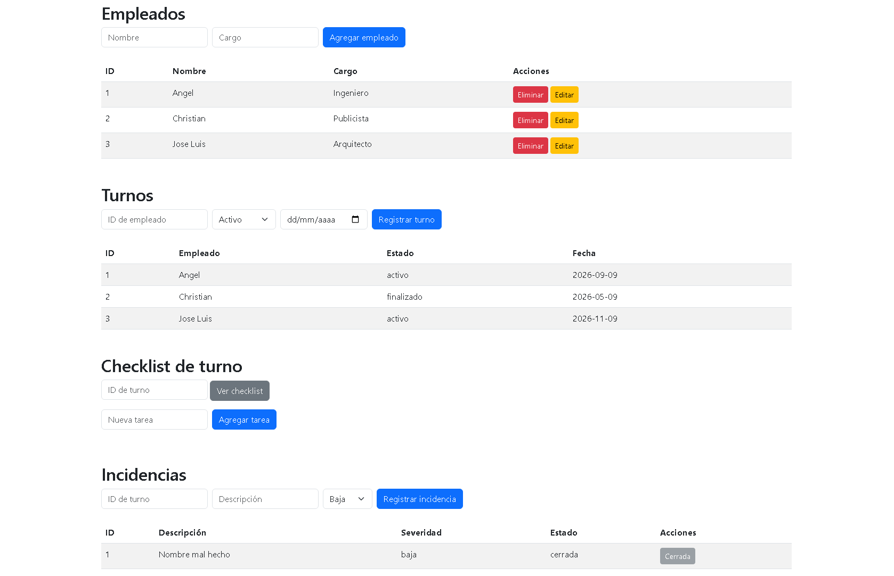

# OpsTrack

Sistema de gestión de turnos, incidencias y checklists operativos, 
construido para digitalizar procesos que en mi experiencia como 
Supervisor de Operaciones se manejaban en hojas de cálculo.

## Demo en vivo
- Frontend: [opsstrack.netlify.app](https://opsstrack.netlify.app/)
- Backend API: [opstrack-ihgm.onrender.com](https://opstrack-ihgm.onrender.com/)
- Usuario de prueba: admin / admin123

## Funcionalidades
- Autenticación con sesiones
- CRUD completo de empleados, turnos e incidencias
- Checklist de cierre de turno con seguimiento de completado
- Dashboard con métricas en tiempo real (Chart.js)

## Stack técnico
- Backend: Python, Flask, SQLite
- Frontend: HTML, CSS (Bootstrap), JavaScript vanilla
- Autenticación: Flask sessions + password hashing
- Deploy: Render (backend) + Netlify (frontend)

## Capturas




## Cómo correrlo localmente

1. Clona el repositorio:
   ```bash
   git clone https://github.com/AngelValdezM/opstrack.git
   cd opstrack
   ```

2. Crea y activa un entorno virtual:
   ```bash
   python -m venv venv
   venv\Scripts\activate  # Windows
   ```

3. Instala las dependencias:
   ```bash
   pip install -r requirements.txt
   ```

4. Inicializa la base de datos:
   ```bash
   python database.py
   ```

5. Corre el servidor:
   ```bash
   python app.py
   ```

6. Abre `frontend/index.html` con Live Server (VS Code) para el frontend.

## Limitaciones conocidas
- La base de datos se reinicia en cada redeploy (plan gratuito de Render)
- Próxima mejora planeada: migración a PostgreSQL para persistencia real